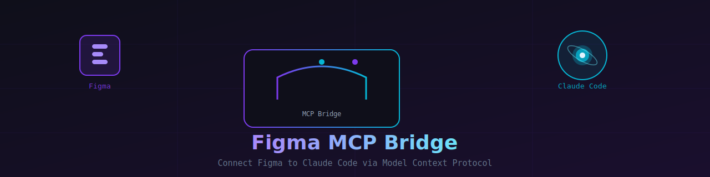

<div align="center">
  
</div>

<br/>

<div align="center">


**Claude Code에서 Figma를 직접 제어하세요.**
Figma 플러그인과 로컬 MCP 서버로 디자인 스펙을 AI 도구로 연결합니다.

</div>

---

## 📐 아키텍처

```
Claude Code (AI)
    └─ MCP 도구 호출 (stdio)
         └─ mcp-server/src/index.ts  ─── MCP 서버 + WebSocket 서버 (:3055)
                  └─ WebSocket
                       └─ src/ui.ts  ─── 플러그인 UI (WebSocket 클라이언트)
                                └─ postMessage
                                     └─ src/code.ts  ─── Figma Plugin API
```

Figma 플러그인이 열려 있는 동안 Claude Code에서 `figma_get_selection`, `figma_get_comments` 등의 도구를 실시간으로 호출할 수 있습니다.

---

## 🚀 설치

### 1. 플러그인 빌드

```bash
cd figma_plugin
npm install
npm run build
```

> `code.js`, `ui.js` 파일이 생성됩니다.

### 2. MCP 서버 설치

```bash
cd figma_plugin/mcp-server
npm install
```

### 3. Figma에 플러그인 등록

1. Figma 데스크탑 앱 실행
2. 메뉴 → **Plugins** → **Development** → **Import plugin from manifest...**
3. `figma_plugin/manifest.json` 선택

### 4. Claude Code에 MCP 서버 등록

프로젝트 루트의 `.mcp.json`이 자동으로 인식됩니다. 전역 등록이 필요한 경우 `~/.claude.json`에 추가:

```json
{
  "mcpServers": {
    "figma-bridge": {
      "command": "node",
      "args": [
        "--import",
        "tsx/esm",
        "/path/to/figma_plugin/mcp-server/src/index.ts"
      ],
      "cwd": "/path/to/figma_plugin/mcp-server"
    }
  }
}
```

> ⚠️ `cwd`는 필수입니다. 경로는 실제 프로젝트 위치에 맞게 수정하세요.

---

## 📖 사용 방법

### 매번 작업 시작할 때

```
1. Figma 데스크탑 앱 열기
2. 작업할 파일 열기
3. Plugins → Development → MCP Bridge 실행
4. 플러그인 패널에 🟢 "MCP 서버 연결됨" 표시 확인
5. Claude Code에서 도구 사용 시작
```

> MCP 서버는 Claude Code 시작 시 자동으로 실행됩니다.

---

## 🛠️ 사용 가능한 도구

### `figma_get_selection`

현재 Figma에서 **선택된 노드의 전체 디자인 스펙**을 가져옵니다.

| 파라미터 | 타입 | 기본값 | 설명 |
|----------|------|:------:|------|
| `maxDepth` | `number` | `5` | 자식 노드 탐색 최대 깊이 |

**반환:** 타이포그래피, 색상(fills/strokes), 레이아웃(flexbox/padding/gap), 테두리, 이펙트, 자식 노드

---

### `figma_get_node`

**특정 노드 ID**로 노드 정보를 가져옵니다.

| 파라미터 | 타입 | 기본값 | 설명 |
|----------|------|:------:|------|
| `nodeId` | `string` | 필수 | 노드 ID (예: `"123:456"`) |
| `maxDepth` | `number` | `5` | 자식 노드 탐색 최대 깊이 |

> Figma URL의 `?node-id=730-16041` → `nodeId: "730:16041"` (하이픈 → 콜론)

---

### `figma_get_page_nodes`

현재 페이지의 **모든 최상위 노드** 목록을 가져옵니다.

| 파라미터 | 타입 | 기본값 | 설명 |
|----------|------|:------:|------|
| `maxDepth` | `number` | `3` | 탐색 깊이 (파일이 크면 낮게 설정) |

---

### `figma_get_file_info`

현재 열린 파일의 **기본 정보**를 가져옵니다. (파라미터 없음)

파일명, 전체 페이지 목록, 현재 페이지, 선택 노드 수 반환

---

### `figma_get_comments`

Figma 파일의 **댓글 전체**를 가져옵니다.

| 파라미터 | 타입 | 기본값 | 설명 |
|----------|------|:------:|------|
| `unresolvedOnly` | `boolean` | `false` | `true`이면 미해결 댓글만 반환 |

---

### `figma_export_node`

노드를 **이미지로 내보냅니다.** 구현과 디자인을 시각적으로 비교할 때 유용합니다.

| 파라미터 | 타입 | 기본값 | 설명 |
|----------|------|:------:|------|
| `nodeId` | `string` | 필수 | 노드 ID |
| `format` | `"PNG" \| "SVG" \| "JPG"` | `"PNG"` | 내보내기 포맷 |
| `scale` | `number` | `2` | 배율 (`2` = @2x) |

---

### `figma_get_styles`

파일에 정의된 **로컬 디자인 시스템 스타일**을 가져옵니다. (파라미터 없음)

색상 팔레트, 텍스트 스타일, 이펙트 스타일 반환

---

## 💡 활용 예시

### 수정 요청 댓글 확인 후 구현

```
1. figma_get_comments({ unresolvedOnly: true })   → 미해결 댓글 목록
2. figma_get_node({ nodeId: "댓글 position.nodeId" })   → 해당 노드 스펙
3. figma_export_node({ nodeId: "..." })   → 디자인 이미지
4. 코드 수정 ✅
```

### 선택 노드와 구현 비교

```
1. Figma에서 비교할 컴포넌트 선택
2. figma_get_selection()   → 전체 디자인 스펙 추출
3. 현재 코드와 값 비교 후 수정 ✅
```

---

## ⚙️ 개발

변경 사항을 감지해서 자동으로 재빌드:

```bash
cd figma_plugin
npm run watch
```

Figma에서 **Plugins → Development → Reload plugin**으로 새 버전 로드.

---

## 🔧 포트 변경

기본 포트는 `3055`입니다. 변경하려면 MCP 서버 설정에 환경 변수 추가:

```json
{
  "mcpServers": {
    "figma-bridge": {
      "env": { "MCP_BRIDGE_PORT": "4055" }
    }
  }
}
```

> `ui.ts`의 `WS_URL`도 동일 포트로 변경 후 재빌드하세요.

---

## 🩺 문제 해결

| 증상 | 원인 | 해결 |
|------|------|------|
| 🔴 플러그인 패널에 빨간 점 | MCP 서버 미실행 | Claude Code 재시작 또는 MCP 설정 확인 |
| `Figma 플러그인이 연결되어 있지 않습니다` | 플러그인 패널 닫힘 | Figma에서 MCP Bridge 플러그인 재실행 |
| 댓글이 비어 있음 | 댓글 없음 또는 권한 부족 | Figma 댓글 탭 직접 확인 |
| 빌드 오류 | node_modules 없음 | `npm install` 재실행 |

---

<div align="center">

Made with ❤️ for [Claude Code](https://claude.ai/code) + [Figma](https://figma.com)

</div>
